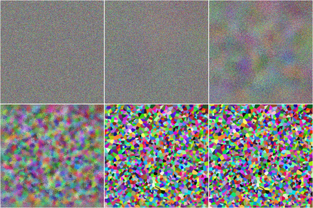

<div align="center">
  <br />
</div>

|     | Research | Authors |
|:----|:---------|:--------|
| \[[slides](https://maciejczyzewski.github.io/fast_gpu_voronoi/slides.pdf)\] | __GPU-Accelerated Jump Flooding Algorithm for Voronoi Diagram in log*(n)__ [this] | Maciej A. Czyzewski |
| \[[article](https://vgl.csa.iisc.ac.in/pdf/pub/ICVGIP14_Talha.pdf)\] | Facet-JFA: Faster computation of discrete Voronoi diagrams [2014] | Talha Bin Masood, Hari Krishna Malladi, Vijay Natarajan |
| \[[article](http://citeseerx.ist.psu.edu/viewdoc/download?doi=10.1.1.101.8568&rep=rep1&type=pdf)\] | Jump Flooding in GPU with Applications to Voronoi Diagram and Distance Transform [2006] | Guodong Rong, Tiow-Seng Tan |

# Implemented Algorithms

|                      | JFA\*           | JFA+    | JFA     |
|----------------------|-----------------|---------|---------|
| used improvement     | noise+selection | noise   | --      |
| num. of needed steps | __log\*(n)__    | log4(p) | log2(p) |
| step size            | p/(3^i)         | p/(2^i) | p/(2^i) |
| research             | (our)           | (our)   | [Guodong 2006] |

# Installation & Example

Project can be installed using `pip`:

```bash
$ pip3 install fast_gpu_voronoi
```

Here is a small example to whet your appetite:

```python3
from fast_gpu_voronoi       import Instance
from fast_gpu_voronoi.jfa   import JFA_star
from fast_gpu_voronoi.debug import save

I = Instance(alg=JFA_star, x=50, y=50, \
        pts=[[ 7,14], [33,34], [27,10],
             [35,10], [23,42], [34,39]])
I.run()

print(I.M.shape)                 # (50, 50, 1)
save(I.M, I.x, I.y, force=True)  # __1_debug.png
```

# Development

If you want to contribute, first clone git repository and then run tests:

```bash
$ git clone git@github.com:maciejczyzewski/fast_gpu_voronoi.git
$ pip3 install -r requirements.txt
$ pytest
```

# Difference

| Our method                      | Current best          |
|:-------------------------------:|:---------------------:|
| JFA\*                           | JFA                   |
|  |  |
| steps = log\*(2000) = 4          | steps = log(720) ~= 10 |

_...for x = 720; y = 720; seeds = 2000 (read as n = 2000; p = 720)._

# Thanks

<div align="center">
  <br />
  
</div>
